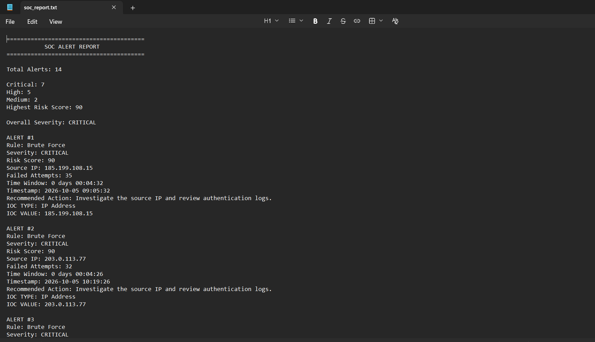

# 🛡️ SOC Log Analyzer

A Python-based Security Operations Center (SOC) log analyzer that detects suspicious authentication activity, prioritizes alerts by risk, extracts indicators of compromise (IOCs), and generates an analyst-ready security report.

> **Project 1 of my journey toward becoming an AI SOC Analyst.**

---

## 🎯 Project Goal

The goal of this project is to simulate part of a real SOC investigation workflow using Python.

Instead of simply parsing log files, the analyzer takes raw authentication events and turns them into prioritized security alerts with:

* Detection logic
* Severity classification
* Risk scoring
* Alert prioritization
* IOC extraction
* Investigation recommendations
* Automated SOC reporting

---

## 🔍 Detection Capabilities

The analyzer currently detects three types of suspicious activity.

### 🚨 1. Brute Force Detection

Identifies multiple failed authentication attempts from the same source IP within a short time window.

**Severity:**

| Failed Attempts | Severity | Risk Score |
| --------------: | -------- | ---------: |
|            5–10 | MEDIUM   |         40 |
|           11–20 | HIGH     |         70 |
|             21+ | CRITICAL |         90 |

---

### 🚨 2. Suspicious Successful Login

Detects a successful authentication occurring after multiple failed login attempts from the same IP within five minutes.

This helps identify scenarios such as:

* Possible credential compromise
* Password spraying
* Brute-force attempts followed by successful authentication

---

### 🚨 3. Multiple Users From One IP

Detects when a single source IP authenticates against multiple user accounts.

This can help identify:

* Account targeting
* Credential attacks
* Compromised infrastructure
* Suspicious shared-source activity

---

## ⚙️ Analysis Pipeline

```text
                Log File
                   │
                   ▼
          ┌─────────────────┐
          │ Load CSV / JSON │
          └────────┬────────┘
                   ▼
          ┌─────────────────┐
          │ Validate Input  │
          └────────┬────────┘
                   ▼
          ┌─────────────────┐
          │ Preprocess Logs │
          └────────┬────────┘
                   ▼
       ┌─────────────────────────┐
       │   Detection Engine      │
       │                         │
       │ • Brute Force           │
       │ • Suspicious Login      │
       │ • Multiple Users / IP   │
       └────────────┬────────────┘
                    ▼
          ┌─────────────────┐
          │ Deduplicate     │
          │ Alerts          │
          └────────┬────────┘
                   ▼
          ┌─────────────────┐
          │ Risk Scoring    │
          └────────┬────────┘
                   ▼
          ┌─────────────────┐
          │ Prioritize      │
          │ Alerts          │
          └────────┬────────┘
                   ▼
          ┌─────────────────┐
          │ IOC Extraction  │
          └────────┬────────┘
                   ▼
          ┌─────────────────┐
          │ Recommendations │
          └────────┬────────┘
                   ▼
          ┌─────────────────┐
          │ SOC Report      │
          └─────────────────┘
```

---

## 📊 Risk Scoring

Every generated alert receives a risk score based on its severity.

| Severity    | Risk Score |
| ----------- | ---------: |
| 🟡 MEDIUM   |         40 |
| 🟠 HIGH     |         70 |
| 🔴 CRITICAL |         90 |

Alerts are then sorted from highest to lowest risk so an analyst can focus on the most important events first.

---

## 🔎 IOC Extraction

The analyzer extracts security-relevant indicators from generated alerts.

Currently supported:

```text
IOC Type: IP Address
IOC Value: <source IP>
```

The IOC extraction layer is intentionally simple at this stage and will be expanded in future projects.

---

## 📝 SOC Reporting

After analysis, the application automatically generates:

```text
reports/soc_report.txt
```

The report contains:

* Total alerts
* Severity summary
* Highest risk score
* Detection rule
* Source IP
* Failed attempts
* Time window
* Username
* IOC information
* Recommended analyst action


---
### Example Output



## 🧪 Testing

The project includes automated unit and integration tests covering the detection and reporting pipeline.

Run all tests with:

```bash
python -m unittest discover
```

Current test coverage includes:

* Brute-force detection
* Suspicious login detection
* Multiple-user detection
* Risk scoring
* Alert integration
* SOC report generation
* IOC extraction

**11 automated tests passing.**

---

## 📁 Project Structure

```text
soc-log-analyzer/
│
├── data/
│   ├── Logs.csv
│   └── logs.json
│
├── reports/
│   └── soc_report.txt
│
├── src/
│   └── analyzer.py
│
├── tests/
│   ├── __init__.py
│   ├── test_brute_force.py
│   ├── test_integration.py
│   ├── test_ioc.py
│   ├── test_multiple_users.py
│   ├── test_report.py
│   ├── test_risk_score.py
│   └── test_suspicious_login.py
│
├── main.py
├── requirements.txt
├── .gitignore
├── LICENSE
└── README.md
```

---

## 🛠️ Technologies

* **Python**
* **Pandas**
* **Tkinter**
* **unittest**
* **Git**
* **GitHub**

---

## 🚀 Running the Project

### 1. Clone the repository

```bash
git clone https://github.com/jamese345/soc-log-analyzer.git
cd soc-log-analyzer
```

### 2. Create a virtual environment

```bash
python -m venv .venv
```

### 3. Activate the environment

Windows PowerShell:

```powershell
.venv\Scripts\Activate.ps1
```

### 4. Install dependencies

```bash
pip install -r requirements.txt
```

### 5. Run the analyzer

```bash
python main.py
```

A file-selection window will open. Select a CSV or JSON log file.

The analyzer will process the events and generate:

```text
reports/soc_report.txt
```

---

## 💡 What I Learned

This project helped me practice building a security automation workflow rather than a simple Python script.

Key areas I worked on:

* Security log analysis
* Detection engineering fundamentals
* Python data processing
* Pandas
* Authentication attack detection
* Alert severity classification
* Risk scoring
* Alert prioritization
* IOC extraction
* Automated security reporting
* Unit testing
* Integration testing
* Git and GitHub

---

## 🗺️ Roadmap

This project is the first step in a larger AI SOC Analyst roadmap.

### Completed

* [x] SOC Log Analyzer

### Next

* [ ] 🚨 Automated Alert Triage Engine
* [ ] 🧠 ML-Based SOC Anomaly Detector
* [ ] 🔎 Threat Intelligence Enrichment Engine
* [ ] 📚 Cybersecurity RAG Assistant
* [ ] 🤖 AI SOC Investigation Agent
* [ ] 🏆 Full AI SOC Analyst Platform

---

## 👨‍💻 About

I'm building practical cybersecurity projects focused on combining:

**Cybersecurity + Python + AI**

My long-term goal is to build intelligent systems for:

* Threat detection
* Alert triage
* Security investigation
* Incident response

---

## 📄 License

This project is licensed under the MIT License.

